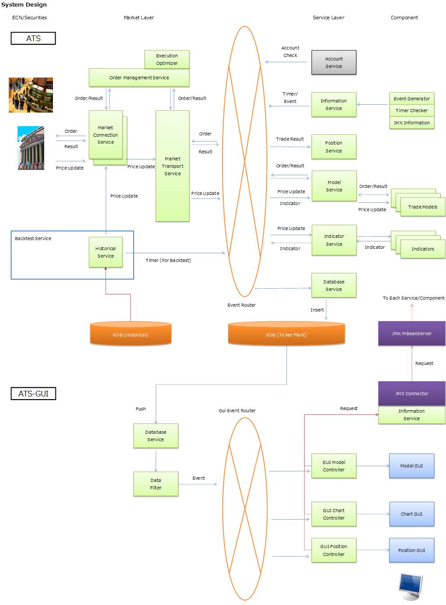

# FX-AlgorithmTrading

FX algorithm trading system with Java/kdb.
- FX automated trading. 
- Realtime and Backtest trading with the same system. 
- Tick data storing to kdb. 
- Java 8 
- kdb 3.0+

For more details please refer to the [documentation](doc/doc_main.md)

## Overall Design

## License
* The MIT License
    * see LICENSE